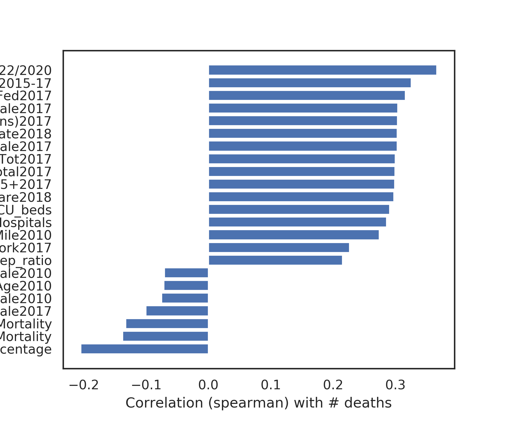

# tldr

1. **Goal:** prioritizing where ventilators go
2. **Approach:** 
    - predict outbreak risk at county-level based on these features
    - filter hospitals and rank them according to their outbreak risk + ventilator need
3. **Data:** 
    - hospital-level: information about hospitals (e.g. number of icu beds, hospital type, location)
    - county-level: confirmed cases + deaths, demographics, comorbidity statistics, voting data, local gov. action data

# 1 - goal: prioritizing where ventilators go

- working with [response4life](https://response4life.org/)
- we would like to prioritize where to send ventilators
- ideally, this would be where the ventilators could do the most "good" (e.g. save the most lives, minimize the Years of Life lost)

# 2 - approach

- we begin by screening for large (academic) hospitals, which can accomodate more ventilators
- **outcome**: as a proxy for ventilator need, we predict the number of deaths (at the county level)
- **key predictors**
    - as a proxy for current ventilator counts, we use the number of icu beds per hospital
        - in reality, there are more ventilators than icu beds
        - some ventilators (maybe 10-20%) will still be needed for non-covid-19 use
    - we also have many county-level predictors
- prediction setup
    - we restrict our analysis to counties which already have confirmed cases
    - each day, we randomly split counties to do prediction

# 3 - data

we have some data at the hospital-level and some at the county-level, which we jointly use to evaluate hospital need

## hospital-level data

- **key predictors**: icu beds, total staff, location info, ratings, hospital type
- potentially contact information and more we are still merging in...

<figure class="video_container">
  <iframe src="https://yu-group.github.io/covid-19-geographic-risk-prediction/results/NY.html" frameborder="0" allowfullscreen="true" style="width:100%;height:100%"> </iframe>
</figure>

## county-level data

- daily number of confirmed cases + deaths (from usafacts)
- population density, age distribution, gender distribution, presidential voting data, risk factors from medicare (e.g. diabetes, respiratory disease, ...), hospital data (e.g. # of doctors, # of hospitals, # of icu beds), and more demographic/disease data

