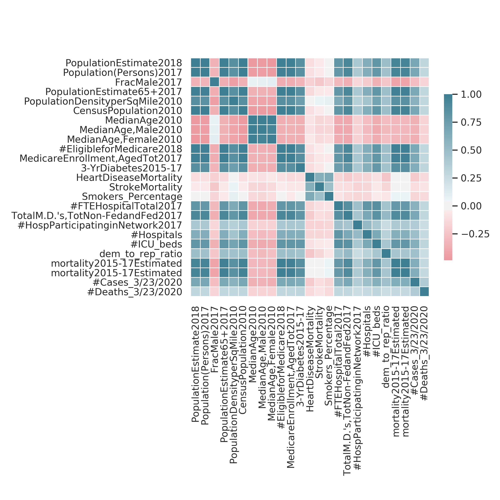

<iframe src="https://docs.google.com/presentation/d/e/2PACX-1vR0IZcUMdTrz6KIw9G1yuzcKHRDUJTS7rQvASzZLKUMi5VFrt18-HptCG6-627VM5McNNNjUirt9fb7/embed?start=false&loop=false&delayms=3000" frameborder="0" width="100%" height="600" allowfullscreen="true" mozallowfullscreen="true" webkitallowfullscreen="true"></iframe>

# quickstart with the data

This section details how to quickly download and get started with the data + models.

## data
1. download the processed data (as a pickled dataframe `df_county_level_cached.pkl`) from [this folder](https://drive.google.com/drive/u/2/folders/1OfeUn8RcOfkibgjtuuVt2z9ZtzC_4Eq5) and place into the `data` directory
2. Can now load/merge the data:
```python
import load_data
df = load_data.load_county_level(data_dir='/path/to/data')
print(df.shape) # (1212, 7306)
```
- note: (non-cumulative) daily cases + deaths are in `data/usafacts/confirmed_cases.csv` and `data/usafacts/deaths.csv` (updated daily)
- note: abridged csv with county-level info such as demographics, hospital information, risk factors, social distancing, and voting data is at `data/df_county_level_abridged_cached.csv`
- for more data details, see [./data/readme.md](./data/readme.md)
- for an intro to some of the analysis here, visit the [project webpage](https://yu-group.github.io/covid19-severity-prediction/)

## prediction
- To get deaths predictions of the naive exponential growth model, the simplest way is to call (for more details, see [./modeling/readme.md](./modeling/readme.md))

```python
df = add_preds(df, NUM_DAYS_LIST=[1, 2, 3]) # adds keys like "Predicted Deaths 1-day"
# NUM_DAYS_LIST is number of days in the future to predict
```

## related county-level projects
- [County-level data summaries from JHU](https://github.com/JieYingWu/COVID-19_US_County-level_Summaries)
- [More aggregated county-level data from Caltech](https://github.com/COVIDmodeling/covid_19_modeling)

    
# overview

1. **Goal**
    - prioritizing where to send medical supplies (i.e. ventilators, masks, etc.)
2. **Approach** 
    - predict expected deaths/cases at the county-level
    - estimate supplies/need based on available data (e.g. number of icu beds, personnel in hospital)
    - filter hospitals and score them according to their expected demand for additional supplies
3. **Data** 
    - county-level: daily confirmed cases + deaths, demographics, comorbidity statistics, voting data, local gov. action data
    - hospital-level: information about hospitals (e.g. number of icu beds, hospital type, location)    
    - limitations
        - currently using proxies for hospitals supplies/demands instead of real measurements
        - limited data on bridging county-level data with hospital-level data
        - missing some local data which would be helpful, such as amount of testing and social distancing measures   
4. **Results**


# 1 - goal: prioritizing where to send medical supplies (i.e. ventilators, masks, etc.)

- working with [response4life](https://response4life.org/)
- ideally, this would be where the supplies could do the most "good" (e.g. save the most lives, minimize the Years of Life lost)

# 2 - approach

- **outcome**: the main thing we predict is the number of deaths (per county)
    - we use many features at the county-level, such as demographics, comorbidity statistics, voting data
    - we are also trying to build in data about social distancing
- understanding supplies: we use proxies for how to distribute county-level resources among hospitals
    - main proxies: num icu beds, num total employees
    - factors to adjust for: hospital type, occupancy rate, demographics, social distancing measures
    
## ventilator-specific approach

- begin by screening for (academic) hospitals, which can accomodate more ventilators
    - we estimate the ventilator need by scaling up the total number of expected deaths
- distributing supply - as a proxy for current ventilator counts, we use the number of icu beds (per hospital)
    - in reality, there are more ventilators than icu beds
    - some ventilators (maybe 10-20%) will still be needed for non-covid-19 use
    - we would also like to build in something local gov. action data (e.g. what has been enacted by local governments)
    - some hospitals are taking measures now to increase their number of ICU beds
    - government also has some stockpiled ventilators, although still unclear where they are

# 3 - data

we have some data at the county-level and some at the hospital-level, which we jointly use to evaluate hospital need

## county-level data

- daily number of confirmed cases + deaths (from usafacts)
- population density, age distribution, gender distribution, presidential voting data, risk factors from medicare (e.g. diabetes, respiratory disease, other chronic conditions), social distancing data from Unacast, hospital-level data (e.g. # of employees, # of icu beds, occupancy rate), and other demographic and disease mortality data

## hospital-level data
- key predictors: icu beds, total staff, location info, ratings, hospital type
- some of this data is not public so we can't share it all here
- potentially contact information and more we are still merging in...

# 4 - results

## looking at some county-level statistics

Many of the county-level features we have collected are correlated with the total number of deaths recorded so far at each county (and with each other):


## interactive visualizations of different counties

We can also plot the predicted number of deaths at the county-level:
<figure class="video_container">
  <iframe src="https://yu-group.github.io/covid19-severity-prediction/results/deaths.html" frameborder="0" allowfullscreen="true" width="100%" height="800"> </iframe>
</figure>

We can visualize these features on interactive maps:
<figure class="video_container">
  <iframe src="https://yu-group.github.io/covid19-severity-prediction/results/NY.html" frameborder="0" allowfullscreen="true" width="140%" height="800"> </iframe>
</figure>

We can plot the outbreak for the counties with the highest number of deaths so far (updated daily):
<figure class="video_container" style="text-align: center">
  <iframe src="https://yu-group.github.io/covid19-severity-prediction/results/county_curves.html" frameborder="0" allowfullscreen="true" width="140%" height="800"> </iframe>
</figure>


# acknowledgements

The UC Berkeley Departments of Statistics, EECS and IEOR led by Professor Bin Yu

- **Yu Group team** (alphabetical order): Nick Altieri, Rebecca Barter, James Duncan, Raaz Dwivedi, Karl Kumbier, Xiao Li, Robbie Netzorg, Briton Park, Chandan Singh (Student Lead), Yan Shuo Tan, Tiffany Tang, Yu Wang
- Shen Group team (alphabetical order): Junyu Cao, Shunan Jiang, Pelagie Elimbi Moudio
- the response4Life team and volunteers
- Helpful input from many including (alphabetical order): SriSatish Ambati, Rob Crockett, Marty Elisco, David Jaffe, Aaron Kornblith, Samuel Scarpino, Suzanne Tamang, Tarek Zohdi
